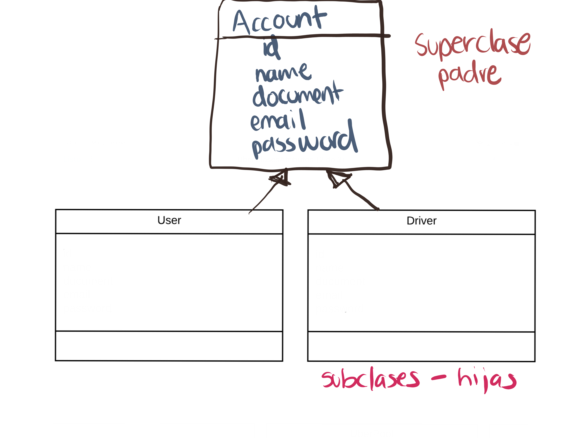
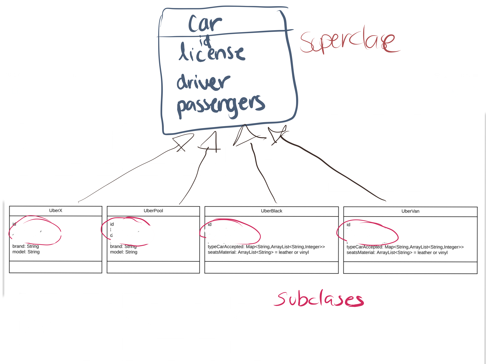
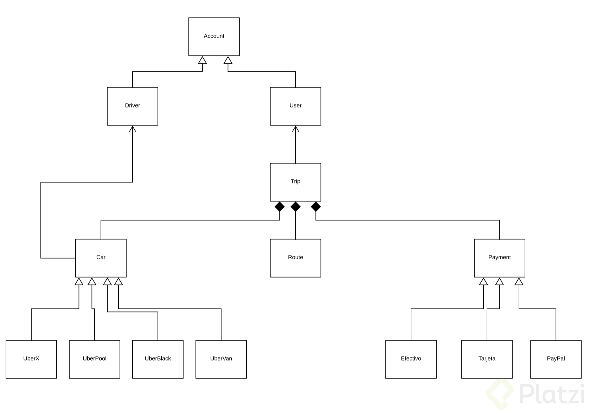

# Paradigma Orientado a Objetos
La **Programación Orientada a Ojetos** viene de una filosofía o forma de pensar que es la Orientación a Objetos y esto surge a partir de los problemas que necesitamos plasmar en código.

Es analizar un problema en forma de objetos para después llevarlo a código, eso es la **Orientación a Objetos**.

Un paradigma es una teoría que suministra la base y modelo para resolver problemas. La paradigma de Programación Orientada a Objetos se compone de 4 elementos:

- Clases
- Propiedades
- Métodos
- Objetos

Y 4 Pilares:

- Encapsulamiento
- Abstracción
- Herencia
- Polimorfismo

En POO se implementa mucho **Don’t repeat yourself** es una filosofía que promueve la reducción de duplicación en programación, esto nos va a inculcar que no tengamos líneas de código duplicadas.

Toda pieza de información nunca debería ser duplicada debido a que incrementa la dificultad en los cambios y evolución

# Lenguajes orientados a objetyos

Algunos de los lenguajes de programación Orientados a Objetos son:

1. Java:
- Orientado a Objetos naturalmente 
- Es muy útilizado en Android 
- Y es usado del lado del servidor o Server Side 

2. PHP:
- Lenguaje interpretado 
- Pensado para la Web 

3. Python:
- Diseñado para ser fácil de usar 
- Múltiples usos: Web, Server Side, Análisis de Datos, Machine Learning, etc 

4. Javascript: 
- Lenguaje interpretado 
- Orientado a Objetos pero basado en *prototipos* 
- Pensado para la Web 

- C#
- Ruby
- Kotlin

# Pasos para la resolucion de un problema en POO
1. Analizar el problema
- Observacion.
- Entendimiento.
- Lectura.

2. Plasmar (Analisi del problema)
- Diagramas

3. Programar (Diagramas)

# Diagramas de modelado
## OMT
Object Modeling Techniques. Es una metodología para el análisis orientado a objetos. **DESCONTINUADO**

## UML
Unified Modeling Language o Lenguaje de Modelado Unificado. Tomó las bases y técnicas de OMT unificándolas. Tenemos más opciones de diagramas como lo son:
- Clases.
- Casos de Uso.
- Objetos.
- Actividades.
- Iteración.
- Estados.
- Implementación.

Esto significa que tendremos una manejara gráfica de representar una situación, justo como hemos venido viendo. A continuación se presentan los elementos que podemos utilizar para hacer estas representaciones.

Las **clases** se representan así:

En la parte superior se colocan los atributos o propiedades, y debajo las operciones de la clase. Notarás que el primer caractér con el que empiezan es un símbolo. Este denotará la visibilidad del atributo o método, esto es un termino que tiene que ver con Encapsulamiento.

Estos son los niveles de visibilidad que puedes tener:

**-** private.
**+** public.
**#** protected.
**~** default.

Una forma de representar las relaciones que tendrá un elemento con otro es a través de las flechas en UML, y aquí tenemos varios tipos, estos son los más comúnies:

### Asociación

Como su nombre lo dice, notarás que cada vez que esté referenciada este tipo de flecha significará que ese elemento contiene al otro en su definición. La flecha apuntará hacia la dependencia.

Con esto vemos que la ClaseA está asociada y depende de la ClaseB.

### Herencia

Siempre que veamos este tipo de fecha se estará expresando la herencia.
La dirección de la flecha irá desde el **hijo hasta el padre**.

Con esto vemos que la ClaseB hereda de la ClaseA

### Agregación

Este se parece a la asociación en que un elemento dependerá del otro, pero en este caso será: Un elemento dependerá de muchos otros. Aquí tomamos como referencia la multiplicidad del elemento. Lo que comúnmente conocerías en Bases de Datos como Relaciones uno a muchos.

Con esto decimos que la ClaseA contiene varios elementos de la ClaseB. Estos últimos son comúnmente representados con listas o colecciones de datos.

### Composición

Este es similar al anterior solo que su relación es totalmente compenetrada de tal modo que conceptualmente una de estás clases no podría vivir si no existiera la otra.

# Analisis del problema

## Modularidad

La **modularidad** va muy relacionada con las clases y es un principio de la Programación Orientado a Objetos y va de la mano con el **Diseño Modular** que significa dividir un sistema en partes pequeñas y estas serán nuestros módulos pudiendo funcionar de manera independiente.

La modularidad de nuestro código nos va a permitir

- Reutilizar
- Evitar colapsos
- Hacer nuestro código más mantenible
- Legibilidad
- Resolución rápida de problemas

Y esto lo logramos a traves de **clases**. Las clases nos permitiran:
- Tener Modularidad
- Diviciones del programa en diferentes partes o módulos/clases.
- Separar las clases en archivos.

Una **buena práctica** es separando las clases en archivos diferentes.

## Objetos
Cuando tengamos un problema lo primero que debemos hacer es observar e **itentificar los Objetos.** Esto imaginandonos en un contexdo de dicho problema.

Los Objetos son aquellos que tienen propiedades y comportamientos, también serán sustantivos.
- Pueden ser Físicos(Manzana, carro, usuario, etc) o Conceptuales(dia, sesion de usuario, cuenta bancaria).

Las **Propiedades** también pueden llamarse atributos y estos también serán sustantivos. Algunos atributos o propiedades son nombre, tamaño, forma, estado, etc. Son todas las características del objeto.

Los **Comportamientos** serán todas las operaciones que el objeto puede hacer, suelen ser verbos o sustantivos y verbo. Algunos ejemplos pueden ser que el usuario pueda hacer login y logout.

## Abstracción y clases
Una Clase sera el modelo(molde) por el cual nuestros objetos se van a construir y nos van a permitir generar más objetos.

**Analizamos Objetos para crear Clases**. Las  Clases son los modelos sobres los cuales construiremos nuestros objetos.

**Abstracción** es cuando separamos los datos de un objeto para generar un molde.

## Ejemplo
A continuacion se muestra el analisis y modelado de un objeto **Uber**.
### Analisis

 debera ser la abstraccion mas general de un objetos.

**Don't Repeat Yourself**. Una forma de identificar herencias es cuando estamos en la presencia de varias clases que comparten los mismos atributos y/o comportamientos. Al se detecta una relacion entre estos objetos se procede a la creacion de una SúperClass de las cuales estas heredaran.

**Ejemplo:**

# Objetos
Los objetos nos ayudan a crear **instancia** de una clase, el objeto es el resultado de lo que modelamos, de los parámetros declarados y usaremos los objetos para que nuestras clases cobren vida.

Los **métodos constructores** dan un estado inicial al objeto y podemos añadirle algunos datos al objeto mediante estos métodos. Los atributos o elementos que pasemos a través del constructor serán los datos mínimos que necesita el objeto para que pueda vivir.

