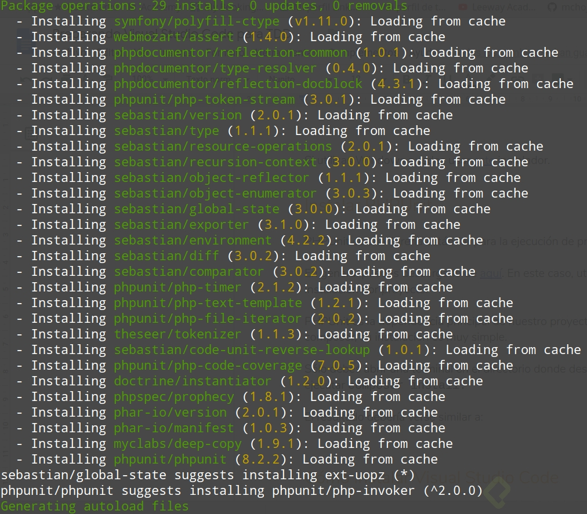
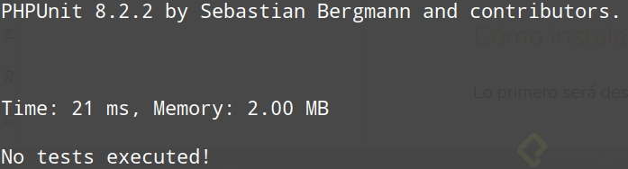
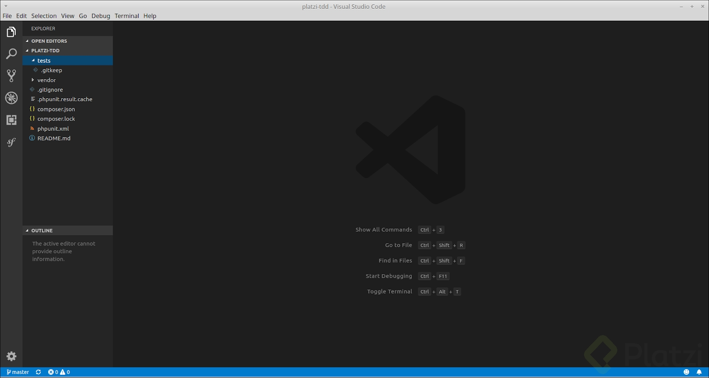
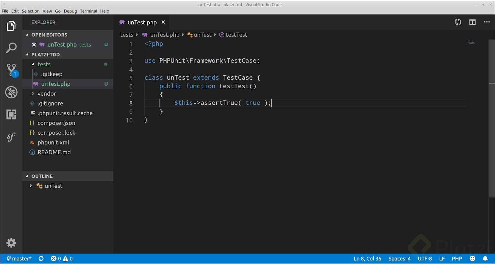
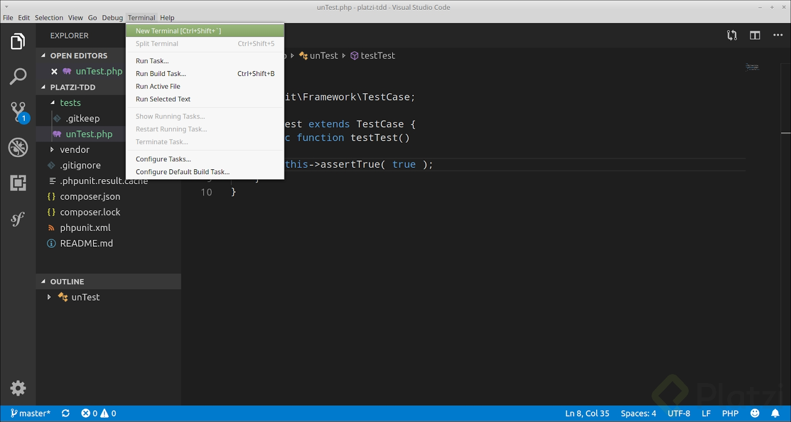
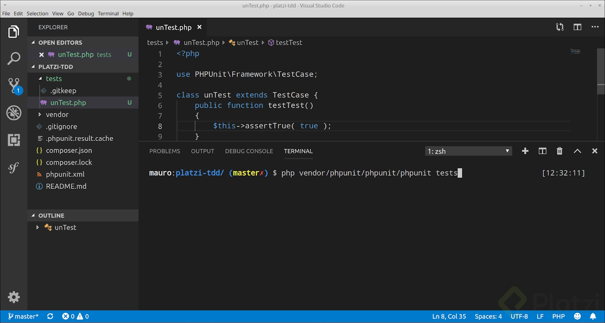
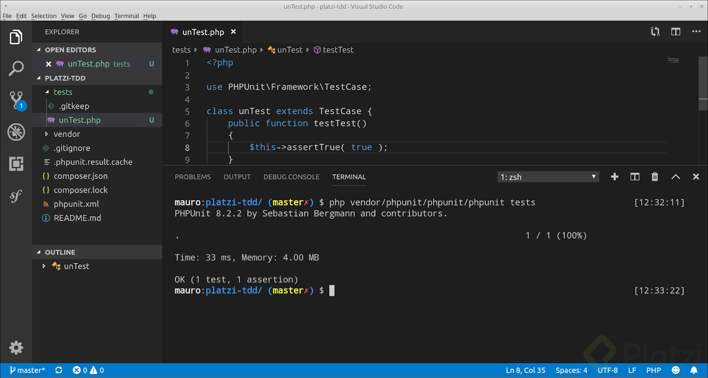

# ¿A quién beneficia contar con código bien escrito?
El código bien escrito beneficia a todos los involucrados en el proyecto.

- **A tí**: Cuando retomemos un proyecto después de un largo tiempo nos beneficiará ya que sabremos cómo está ordenado y cómo está escrito todo.
- **A cualquiera**: Cualquier persona que deba modificar el código después de tí.
- **A tu cliente**: Aunque nunca lo sabrá, su negocio estará mejor atendido.

# Elementos dotan de calidad al código:
- [Legibilidad](#legibilidad): qué tan fácil es interpretar lo que el código dice.
- [Mantenibilidad](#mantenibilidad): cuánto esfuerzo supondrá adaptar el código a nuevos requerimientos.
- Testeabilidad: cuánto esfuerzo supondrá realizar pruebas sobre este código.

<a name="legibilidad"></a>
## Legibilidad
El código fuente lo escribimos para personas como tú y yo, para las computadoras tenemos las versiones compiladas.

Debemos seguir un estándar de codificación, el cual nos ayuda a:
- Generar código claro y consistente.
- Evitar perder tiempo en decisiones triviales.

### Acoplate a un estandar
 Un estandar de codificacion es una seria de reglas que indica como debes escribir el codigo. Como por ejemplo ¿Donde deben inicar las lleves de un bloque de codigo?, ¿ cuantas lineas de separacion hay entre los bloques?, ¿Cual es la sintaxis para la creacion de variables?, etc.

1. **Define un estándar:**Piénsalo una vez y déjalo por escrito.
**NOTA:** Puede ser el del lenguaje que se esta manejando, normalmente esta documentado en la web del lenguaje de programacion.

2. **Respétalo:** Haz un esfuerzo por adherirte al estándar durante tu día a día.

3. **Apóyate en algún linter:** Esta sencilla herramienta te ayudará a incorporar buenas prácticas.

### Identificadores: mnemotécnicos, específicos y precisos
Los identificadores son variables, funciones, clases, módulos, componentes, etc. Elementos a los que nosotros debamos crearles un nombre propio.

Ejemplo sin un identificador mnemotécnico una función se vería así:
``` [PHP]
function f( int $b, int $a ) : float {
        return ( $b * $a ) / 2;
}
```
Al leer este código no sabemos para qué funciona y hasta podríamos borrarlo por equivocación.

Ahora utilizando un identificador mnemotécnico se vería así:
``` [PHP]
function areaTriangulo( int $base, int $altura ) : float {
        return ( $base * $altura ) / 2;
}
```
Ahora gracias a que el código es más legible sabemos para qué funciona esta función.

Atención a los identificadores que estableces: Un buen indicador es pedirle a alquien que trabaje contigo que lea el codigo y que te diga que hace.

<a name="mantenibilidad"></a>
## Mantenibilidad

### Código modular
El código modular son pedazos de códigos divididos(normalmente en funciones) que pueden ser utilizados en cualquier lugar para evitar tener un solo archivo con un bloque de código gigante.

Bloques de codigo potenciales para modularizar:
- Aquellos que estan dentro de un bucle.
- Los que estan dentro de un condicional.
- Codigo que realice calculos o metodos complejos.
- Codigo que se repita/realice con frecuencia.

### Codigo reutilizable
Escribir código reutilizable nos va a ayudar a que en lugar de copiar y pegar una misma línea de código pero con diferentes parámetros lo hagamos a través de una función que retorne los valores que necesitamos y luego la podremos llamar en cualquier lugar del código que necesitemos pasándole los parámetros que deseamos.


### Código organizado
El código organizado se refiere a cómo tenemos distribuido nuestros archivos en la raíz (root) del proyecto. A mayor organización, mayor entendimiento del código. 
Usualmente lo que haremos es agrupar los archivos que tengan contenido similar en directorios que tengan sentido. Ejemplo:

Convencion de distribucion de archivos en PHP moderno:
```
/public
/src
/tests
/vendor    
```
**Directorios**
- **public**: Contiene todos los documentos que son accesibles desde afuera del servidor.
- **src**: Contiene todos los archivos propios de nuestro codigo fuente(nuestro proyecto).
- **test**: Pruebas a realizar.
- **vendor**: dependencias/librerias de terceros.

# Libre de vicios

## Evitar el hardcoding
El hardcoding es la práctica de escribir *valores literales* en lugar de *identificadores*. **NO debe de usarse**, ya que si el día de mañana debemos cambiar los valores eso significa que debemos cambiar el código en los lugares que esté ese valor estático por completo y luego mandar a producción, cuándo podríamos hacer el cambio más orgánico en una variable que afecte a todos los lugares que es llamada. Para esto utilizamos variables de configuracion o variables de entorno, es decir variables que son exernas al codigo fuente de nuestro programa.

## Evitar efectos colaterales
Los efectos colaterales en este caso son aquellos que suceden mas alla del codigo que se esta leyendo. Debemos analizar muy bien nuestro código para evitar efectos colaterales y evitar que nuestro código deje de funcionar.
**Consejos:**
- **No** uses variables globales.


# Principios SOLID: Single Responsibility Principle
**SOLID** son cinco principios básicos de la programación orientada a objetos que ayudan a crear software mantenible en el tiempo.

**SOLID** significa:

- [S](#single): Single Reponsibility Principle.
- [O](#open): Open/Closed Principle. 
- [L](#liskov): Liskov Substitution Principle. 
- [I](#interface): Interface Segregation Principle. 
- [D](#dependency): Dependency Inversion Principle. 

<a name="ingle"></a>
## Single Reponsibility Principle
La S se trata de una clase que debe tener sólo una razón para cambiar. Es decir, que cada clase debe tener una UNICA responsabilidad.

<a name="open"></a>
## Open/Closed Principle
Establece que una entidad de software debe quedarse abierta para su extensión, pero cerrada para su modificación. Es decir, las entidades, clases, metodos deben quedar abierta al posibilidad de extension, de esta forma la clase puede adaptarse a nuevos esenarios sin la necesidad de modificar o añadir codigo. Ejemplo:

**Violacion_O/C**: Aqui vemos como la funcion valida el tipo de documento que se desea procesar, de esta manera seria imposible agregar un nuevo estilo de documento sin modificar el archivo
``` [PHP]
<?php

class DocProcessor
{
        public function process( array $docs )
        {
                foreach ( $docs as $doc ) {
                        if ( $doc instanceof Invoice ) {
                                $doc->sendToClient();
                        } elseif ( $doc instanceof Receipt ) {
                                $doc->archive();
                        } elseif ( $doc instanceof Memo ) {
                                $doc->markAsRead();
                        }
                }
        }
}
```
**O/C_Respetado**: En este cado el metodo se encarga de procesar directamente el archivo, delegando la responsabilidad de validar el archivo a otra clase.
``` [PHP]
<?php

class DocProcessor
{
        public function process( array $docs )
        {
                foreach ( $docs as $doc ) {
                        $doc->process(); 
                }
        }
}
```
<a name="liskov"></a>
## Liskov Substitution Principle
Establece que cada clase que hereda de otra puede usarse como su padre sin necesidad de conocer las diferencias entre ellas. Para que pueda darse este principio debe cumplir con dos puntos:
- El cliente debe usar métodos de la clase padre únicamente.
- La clase hija no debe alterar el comportamiento de los métodos de la clase padre.

**Consejos**
En el caso de que una clase hija requiera modificar el codigo de un metodo de la clase padre, vale la pena preguntarse ¿Estas clases deben estar relacionados hereditariamente?, lo mas seguro es que la respuesta sea no, y mantengan otro tipo de relacion.

<a name="interface"></a>
## Interface Segregation Principle.
Establece que los clientes de un programa cuando implementan una interface sólo deberían conocer de éste los métodos que realmente usan. Es decir, no deben implementar interfaces con metodo que no utilizan en su codigo fuente.

**Consejos**
En el casode que tengas un metodo implementando interfaces con metodos que este no utilizara(o seria estupido que los utilizara), debemos "paritr" la interfaz en varias interfaces. Recordemos que una misma clase puede implementar varias interfaces.

<a name="dependency"></a>
## Dependency Inversion Principle.
Detalla que los módulos de alto nivel no deben depender de los de bajo nivel, ambos deben depender de abstracciones. Es decir, los objetos no deben ser creador dentro de las clases sino pasados como parametro. Y a su vez estos parametros no deben ser de un tipo de clase en especial, sino que deberan depender de un interfaz.

Las abstracciones no deben depender de los detalles, los detalles deben depender de las abstracciones.

Para entender lo antes dicho definamos las clases de alto y bajo nivel:
1. **Clases de alto nivel:**
Son aquellas que tienen que ver con la logica de negocio. Con la aplicacion especifica que se esta desarrollando.
2. *Clases de bajo nivel:*
Son aquellas que existen con el proposito de ayudar a las clases de alto nivel a cumplir su cometido.

# Patrones de Diseño
Los patrones de diseño son soluciones de arquitectura de software aplicables a diferentes problemas. Estos son soluciones conceptuales que se pueden aplicar a la hora de pensar como diseñar las clases.

Basicamente existen 3 tipos:

1. [**Creacionales:**](#creacionales) Nos hablan de como se crean nuevas instancias de los objetos.

Entre ellos encontramos:
- [*Abstract Factory*](#abstract_factory): Provee una interfaz para la creacion de familias de objetos sin espeficicar una clase en concreto.
- [*Builder*](#builder): Separa la construccion de objectos complejos.
- [*Factory Method*](#factory_method): Define un interfaz para la creacion de un objecto pero deja qu la subclase decida que clase instanciar.
- [*Prototype*](#prototype): especifica que tipo de objectos crear usando una instancia prototipo y crea nuevos objecos copiando este prototipo.
- [*Singleton*](#singleton): Nos aseguramos que una clase solo puede ser instanciada una vez, ademas de proveer un punto de acceso a esta.

2. [**Estructurales:**](#estructurales) Nos hablan de como debemos estructurar nuestras clases para crear estructuras flexibles y eficientes.

Entre ellos encontramos:
- [*Adapter*](#adapter): Convierte la interaz de una clase en otro interfaz quee cliente espera.
- [*Bridge*](#bridge): Nos permite desacoplar un a abstracción de su implementacion, de manera que ambas puedan ser modificadas indepedientemente sin necesdad de alterar por ello la otra.
- [*Composite*](#composite): sirve para construir objetos complejos a partir de otros más simples y similares entre sí, gracias a la composición recursiva y a una estructura en forma de árbol.
- [*Decorator*](#decorator): Agrega responsabilidades adicionales a un objeto de forma dinámica.
- [*Facade*](#facade): Nos permite utilizar módulos complejos de una forma sencilla y con bajos costos para el cliente.
- [*Flyweight*](#flyweight):Nos permite eliminar o reducir redundancia cuando trabajamos con una gran cantidad de objetos.
- [*Proxy*](#proxy): Permite controlar el acceso a diferentes áreas de módulos.


3. [**De Comportamiento:**](#comportamiento) Hablan sobre como deben comportarse nuestros objetos. Gestionando algoritmos y responsabilidades entre ellos.

Entre ellos encontramos:
- [*Chain of Responsibility*](#chain_of_responsability): Evita acoplar el emisor de una petición a su receptor dando a más de un objeto la posibilidad de responder a una petición. Para ello, se encadenan los receptores y pasa la petición a través de la cadena hasta que es procesada por algún objeto.
- [*Command*](#command): Permite solicitar una operación a un objeto sin conocer realmente el contenido de esta operación, ni el receptor real de la misma. Para ello se encapsula la petición como un objeto, con lo que además facilita la parametrización de los métodos.
- [*Interpreter*](#interpreter): Dado un idioma, define una representación para su gramática junto con un intérprete que use la representación para interpretar oraciones en el lenguaje.
- [*Iterator*](#iterator): Define una interfaz que declara los métodos necesarios para acceder secuencialmente a un grupo de objetos de una colección.
- [*Mediator*](#mediator): Define un objeto que encapsula cómo un conjunto de objetos interactúan.
- [*Memento*](#memento): Permite almacenar el estado de un objeto (o del sistema completo) en un momento dado de manera que se pueda restaurar en ese punto de manera sencilla. Para ello se mantiene almacenado el estado del objeto para un instante de tiempo en una clase independiente de aquella a la que pertenece el objeto (pero sin romper la encapsulación), de forma que ese recuerdo permita que el objeto sea modificado y pueda volver a su estado anterior.
- [*Observer*](#observer): Define una dependencia del tipo uno a muchos entre objetos, de manera que cuando uno de los objetos cambia su estado, notifica este cambio a todos los dependientes.
- [*State*]: Se utiliza cuando el comportamiento de un objeto cambia dependiendo del estado del mismo.
- [*Template Method*](#template_method): Define el esqueleto de programa de un algoritmo en un método, llamado método de plantilla, el cual difiere algunos pasos a las subclases.
- [*Visitor*](#visitor): Representa una operación que se realiza sobre los elementos que conforman la estructura de un objeto.

***IMPORTANTE:*** Es importante recalcar que los patrones de diseño son para darte una idea de como diseñar tu aplicacion, no son un "copia y pega" pues no siempre son la mejor solucion que se adapta a tu problema en algunas cosos puede ponerte las cosas mas dificiles.

## Creacionales 
### Singleton 
Permite restringir la creación de objetos pertenecientes a una clase o al valor de un tipo a un único objeto. Dicho de otra manera la idea es tener **una sola instancia** de la clase a lo largo de toda nuestra aplicacion.
Ejemplo:
``` [PHP]
class Singleton
{
    private static $theInstance = null;
    public statis function getInstance(){
        if ( self::$theInstance === null ) {
            self::$theInstance = new sefl();
        }
        return self::$theInstance
    }
    privade function __contruct() {
        // code..
    }
}
```
Como acabamos de ver solo puede existir una instancia de esta clase durante la vida de esta aplicacion ya que esta puede ser creada solo desde dentro de ella misma, Y esta configurada para que al crearse por primera vez, no se vuelva a cronstruir.

Un ejemplo de creacion por el patron Singleton son los *log de errores* de las aplicaciones.

### Factory
Se utiliza para ayudar a la creacion de nuevas instancias. Este patron es util cuando la **creacion** de un objeto es un proceso muy **complejo**

Ejemplo:
``` [PHP]
class Automobile
{
    private $vehicleMake;
    private $vehicleModel;

    public function __contruct($make, $model) {
        $this->vehicleMake = $make;
        $this->vehicleModel = $model;
    }

    public function getMakeAndModel() {
        return $this->vehivle.Make.' '.$this->vehicleModel;
    }
}

class AutomobileFactory
{
    private static $model = 2019;

    public static function create($make)
    {
        return new Automobile($make, self::$model);
    }
}

$a = new Automobile('Renault', 2019);
$b = AutomobileFactory::create('Toyota');
```
## Estructurales
### Decorador
El patrón Decorator responde a la necesidad de añadir dinámicamente funcionalidad a un Objeto. Esto nos permite no tener que crear sucesivas clases que hereden de la primera incorporando la nueva funcionalidad, sino otras que la implementan y se asocian a la primera. 

 
## De Comportamiento
### Command
Es un patron de comportamiento. Se utiliza cuando hay una operacion, especialmente compleja, que debe ser realizada desde diferentes puntos de entrada.
Tipicamente este sucede cuando realizando una app WEB se debe realizar la misma operacion desde consulta de algun visitante como desde la linea de comandos.
Permite solicitar una operación a un objeto sin conocer realmente el contenido de esta operación, ni el receptor real de la misma. Para ello se encapsula la petición como un objeto, con lo que además facilita la parametrización de los métodos. Ejemplo:
``` [PHP]
interface CommandInterface
{
    public function execute():
}
```
Usualmente la interfaz va de esta manera simple. ¿Que es lo que hara el 'execute' en este caso?
Bueno eso dependera del comando en especifico. pero de esta manera nos permite implementar facilmente el principio Open/Closed por ejemplo; Teniendo una lista de comando, ejecutarlos todos bajo un mismo metodo.

### Observer
El patrón observer se compone de un sujeto que ofrece mecanismos de suscripción y desuscripción a múltiples observadores que quieren ser notificados de los cambios en dicho sujeto. Cada observador expone un método de **update** que es usado por el sujeto para notificar cualquier cambio a todos los suscritos.

Es uno de los patrones más utilizados, algunos ejemplos típicos son:
Newsletter
Sockets
Listeners en páginas web

# Documentacion
Documentar es una de las mejores prácticas que podemos hacer cuando estamos en un equipo de trabajo.
- Dejar por escrito cómo hemos hecho algunas funcionalidades.¿Cual es la logica del negocio?
- Sobretodo debemos dejar comentarios en el código que ayuden a las personas a ubicarse en qué parte de la aplicación están y qué hacen esas líneas de código.

## ¿Que Documentar?
Es un poco complejo pero basicamente tienes que documentar pensando en la persona que tomara tu codigo cuando tu lo deje(esa persona que continuara tu trabajo), tienes que documentar pensando en que la persona que leera esas linea no tiene la menor idea de que hace tu aplicacion. Algunas preguntas utilies para documentar tu codigo son:

- ¿Como implementar una nueva funcionalidad en caso de querer hacerlo?
- ¿Cómo podría ser mejorando el código?.
- ¿Como se realizan las pruebas?
- ¿Quienes son los involucrados en el proyecto?
- ¿Como se puede llevar nuevo codigo a produccion?
- Etc. Toda aquella pregunta que nos lleve a ser mas claros en como manipular el codigo.

## ¿Como Documentar?
Esta depende de quienes son las personas que leeran este codigo.
- ¿Usan lenguaje tecnico?
- ¿tiene suficiente experiencia?
- ¿Tiene un conocimiento similar al tuyo?

Al hablar de Documentacion no hablamos solamente de texto, los graficos tambien son muy buenos para comprender las ideas como por ejemplo UML.

## ¿Donde documentar?
Basicamente existen dos lugar:
- **Dentro del propio codigo.**
``` [PHP]
<?php

/** 
* Retorna la suma de dos numeros enteros
* @param int $a
* @param int $b
*/
function add ( int $a, int $b ) {
   
    return $a +$b;
}
```
Documentacion clara, concisa y pequeña.

- **Algun otro repositorio:** una wiki, documentos compartidos, etc.

## ¿Cuando documentar?
- Lo ideal es ir escribiendo la documentacion a la par del codigo. A penas terminas de escribir el codigo, ir y escribir su documentacion.

- Cuando pudiste resolver un problema bastate complejo y notaste que te faltaba informacion.

# Testing Automatizado
Existen dos tipos de testing, es completamente recomendado(es lo correcto) realizar ambos tipos:

*NOTA:* En *PHP* podemos utilizar *phpUnit* para realizar nuestros test.

1. **Unit Testing:**
Evaluamos el funcionamiento de los componentes individualmente. Esto fomenta:
- el refactory(volver a escribir el codigo de una mejor manera).
- Facilita la integracion con otras piezas de codigo.
- Ayuda a dejar el codigo documentado.

Para **implementar el unit testing** requerimos de una herramienta que nos permita escribir el test y por otro lado mirar sus resultados.

2. **Integration Testing**: Validar la interacción entre los componentes y el sistema completo. En estas pruebas se evalua y hacen prueba ya del 'producto' final que debe arrojar el programa.

## Creacion de un entorno de pruebas en PHP
crearemos un entorno para poder ejecutar PHPUnit (El framework de pruebas unitarias más utilizado con PHP).

1. **Descargar el proyecto**
El primer paso es clonar el repositorio https://github.com/mchojrin/platzi-tdd

2. **Instalar PHP**
Si estás en un entorno Linux o Mac probablemente ya tendrás PHP instalado, con lo cual puedes saltar este paso.

Si estás en Windows deberás descargar PHP de aquí y probablemente también tengas que instalar el Runtime de Visual C++ que puedes descargar de aquí.

Para comprobar que la instalación haya sido exitosa debes abrir una terminal y ejecutar el comando php -v.

3. **Instalar Composer**
Una vez instalado PHP el siguiente paso es instalar composer, un manejador de dependencias para php (Puedes leer más de qué se trata [aquí](https://academy.leewayweb.com/que-es-composer/)).

La forma más simple de instalar composer es hacerlo a través del propio php siguiendo las instrucciones presentes [aquí](https://getcomposer.org/download/).

Si utilizas Windows puedes usar [este](https://getcomposer.org/Composer-Setup.exe) instalador.

4. **Instalar PHPUnit**
PHPUnit es una librería estándar para la ejecución de pruebas unitarias de PHP.

En general puedes descargarlo de [aquí](https://phpunit.de/getting-started/phpunit-8.html). En este caso, utilizaremos la versión de instalación por proyecto.

PHPUnit es la dependencia principal de nuestro proyecto, si tienes instalado composer, su instalación es muy simple.

Sólo debes abrir una terminal en el directorio donde descargaste el proyecto y ejecutar `composer install`.

El resultado debería verse similar a:



Para verificar la instalación ejecuta el comando `php vendor/phpunit/phpunit/phpunit`

La salida debería verse así:



5. **Configurar el entorno**
Durante este curso utilizamos Visual Studio Code. Si ya dispones de otro entorno y lo conoces bien puedes utilizarlo, si no tienes preferencia te recomiendo que utilices VS Code.

Puedes descargarlo de [aquí](https://code.visualstudio.com/Download)

Una vez instalado abre la carpeta donde descargaste el proyecto en Visual Studio. Deberas ver algo como:



Escribe un primer test para verificar que todo está configurado correctamente:



Y para ejecutarlo, abre un terminal dentro del Visual Studio Code:




Una vez en la consola escribe el comando: `php vendor/phpunit/phpunit/phpunit tests`



Y deberás ver en la salida:



Con esto tendrás todo lo necesario para avanzar al proximo punto(TDD)

## Test Driven Development
[TDD](https://www.youtube.com/watch?time_continue=44&v=EBtu4WyWHPc) o Test Driven Development es una metodología donde hacemos todo al revés(Esta propone: Primero escribir las pruebsa y luego el software). Por un momento vamos a dejar de programar para dedicarnos a escribir las pruebas.

Este tipo de prueba es del tipo *unit test* y Se trata de lo siguiente:

- Pensar en una funcionalidad que queremos implementar y preguntarnos ¿Como vamos a determinar que lo que vayamos a implementar efectivamente es correcto y hace lo que debe hacer?
- Escribimos el test
- Esperamos que falle.
- Escribimos el minimo codigo necesario para que funcione.
- Examinamos nuestro codigo en busca de mejoras.
- Repetir
Ejemplo:
``` [PHP]
<?php 

use PHPUnit\Framework\TestCase;


class CalculatorTest extends TestCase
{
    public function testAddWillReturnTheSumOfItsParameters()
    {
        $sut = new Calculator();
     
        $this->assertEquals(8, $sut->add(5,3));
        $this->assertEquals(5, $sut->add(5,0));
    }

    public function testAddWillReturnTheSubtractOfItsParameters()
    {
        $sut = new Calculator();
     
        $this->assertEquals(5, $sut->subtract(8,3));
        $this->assertEquals(8, $sut->subtract(10,2));
        $this->assertEquals(2, $sut->subtract(4,2));
    }
    
    public function testAddWillReturnTheMultiplyOfItsParameters()
    {
        $sut = new Calculator();
     
        $this->assertEquals(24, $sut->multiply(8,3));
        $this->assertEquals(20, $sut->multiply(10,2));
        $this->assertEquals(8, $sut->multiply(4,2));
    }

    public function testAddWillReturnTheDivideOfItsParameters()
    {
        $sut = new Calculator();
     
        $this->assertEquals(5, $sut->divide(10,2));
        $this->assertEquals(20, $sut->divide(40,2));
        $this->assertEquals(4, $sut->divide(8,2));
    }
}


<?php
class Calculator
{
    public function add(int $a, int $b): int
    {
        return $a + $b;
    }
    
    public function subtract(int $a, int $b): int
    {
        return $a - $b;
    }
    
    public function multiply(int $a, int $b): int
    {
        return $a * $b;
    }

    public function divide(int $a, int $b): float
    {
        if ($b ===0) {
            thrownew InvalidArgumentException('No se puede dividir entre 0');
        }
        return $a / $b;
    }
    
}


Resultados de pruebas:


root@debian:/var/www/html/platzi/platzi-tdd# vendor/phpunit/phpunit/phpunit --testdox  tests/CalculatorTest.php
PHPUnit 8.2.2 by Sebastian Bergmann and contributors.

Calculator
 ✔ Add will return the sum of its parameters
 ✔ Add will return the subtract of its parameters
 ✔ Add will return the multiply of its parameters
 ✔ Add will return the divide of its parameters

Time: 52 ms, Memory: 4.00 MB

OK (4 tests, 11 assertions)
```
